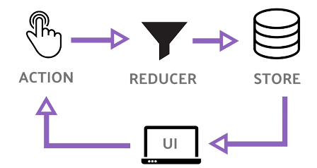

## Lecture 1
- install nodejs >=12
- explore what is nvm 
- install git on your system 

## React Basics
- Hooks and dynamic components
- Classes -> Hooks
- 10 Built in Hooks 

- Why Hooks?
    1. In the past stateful logic was tightly coupled to a class component, it resulted in a complex neseted code structure
    2. Hooks remove reactivity from components
    3. Hooks start with "use"
    4. Call hooks only in the top order of the file, they wont work inside a loop or anything like that 
    5. Custom Hooks are an exception to the above point 

- Basic Hooks
    - useState
    most used, handles reactive data when data changes re-render the UI, 
    import {useState} from 'react'
    const [count,setCount] = useState(0)
    count is variable and setCount is a setter function 

    - useEffect
    Component life cycle
    componenetDidMount(){//initialized}
    componentDidUpdate(){// state updated}
    componenetWillUnmount(){//destroyed}
    useEffect(()=>{
        alert('hello side effect!')
    })
    useEffect(()=>{
        fetch('foo').then(()=> setLoaded(true))
    }, [count]) // empty array means only once, now it runs whenever the count changes

    useEffect(()=>{
        alert('hello side effect!')
        return ()=> alert('goodbye component') 
        // Run befoer component is removed from UI
    })
    - useContext
    work with Context API, share data without passing props, 
    const MoodContext = createContext(moods)
    // and inside 
     <MoodContext.Provider>
        <MoodEmoji />
     </MoodContext.Provider>

     function MoodEmoji(){
        const mood = useContext(MoodContext)
        return <MoodContext.Consumer>
 {mood} 

                </MoodContext.Consumer>
     }

- Additional Hooks 
    - useReducer
    Similar to use state
    a different way to manage a state
    
    dispatch an action 
    Handled in a switch statement 
    why : 
    - useCallback
    Memoise an entire function
    
    - useMemo
    Optimize computation cost for improved performance 
    Memoization : cache result of function call 
    use only as needed for expenseve calculations 

    - useRef
        create a mutable object that keeps reference between render
        it wont trigger rerender 
        common usecase is to grab native HTML from jsx
        function App(){
            const myBtn = useRef(null);
            const clickIt = () => myBtn.current.click()

            return <button ref={myBtn}> </button>
        }
    - useImperativeHandle
        //rare
    - useLayoutEffect
        // runs after render but before painting to screen 
        blocks visual updates until your callback is finished 

    - useDebugValue
    this hook wont make sense till you start building your own hooks 

## Firebase Basics
- Why firebase and what is firebase 
- Bass Backend as a servive
- node -v
- Sign into firebase : firebase is an extension of google cloud 
- create a project in firebase 
- go to project settings and create a webapp 
- basic setup and imports in html 
- npm install firebase-tools -g 
- firebase login 
- Install firebase explorer extension for VS code

- What is firebase Hosting? 
- firebase init

#### User Authentication 

#### Databases in firebase
firestore

